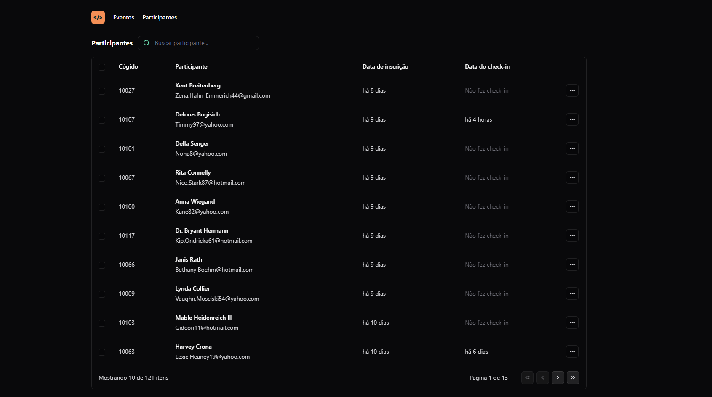

<h1 align="center"> Pass-in </h1>

Projeto realizado durante o NWL Unite da Rocketseat
A aplicação é um projeto de gestão de participantes para eventos.

## 🚀 Tecnologias
Esse projeto foi desenvolvido com as seguintes tecnologias:

- React
- Tailwind
- Git e Github
- Figma
- TypeScript

## 💻 Projeto

O projeto foi feito com o intuito de criar o dashboard para organização de eventos, onde podemos gerenciar participantes e visualizar a parte de check-in.

## 
O desafio foi proposto na NWL Unite da Rocketseat. A ideia é aplicar conhecimentos e fundamentos do React e Tailwind

- Responsividade
- Programação Declarativa
- Padrão Factory ( Organização código)
- Manipulação de API

## 
  

    Desenvolvido por: Guilherme Damasceno
  

